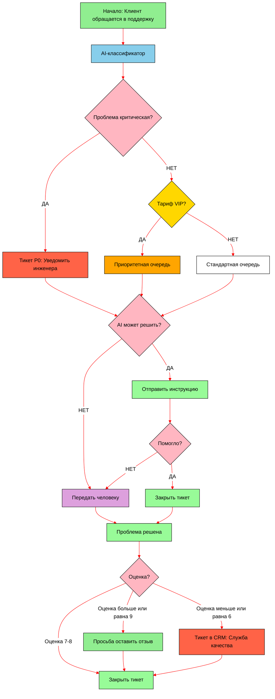

```mermaid
%%{init: {'theme': 'base', 'themeVariables': {
  'background': '#24292e', 
  'lineColor': '#FF0000', 
  'primaryColor': '#ffffff', 
  'primaryTextColor': '#000000', 
  'primaryBorderColor': '#000000'
}}}%%
graph TD
    A[Начало: Клиент обращается в поддержку] --> B[AI-классификатор]
    B --> C{Проблема критическая?}
    C -->|ДА| D[Тикет P0: Уведомить инженера]
    C -->|НЕТ| E{Тариф VIP?}
    E -->|ДА| F[Приоритетная очередь]
    E -->|НЕТ| G[Стандартная очередь]
    D --> H{AI может решить?}
    F --> H
    G --> H
    H -->|ДА| I[Отправить инструкцию]
    H -->|НЕТ| J[Передать человеку]
    I --> K{Помогло?}
    K -->|ДА| L[Закрыть тикет]
    K -->|НЕТ| J
    J --> M[Проблема решена]
    L --> M
    M --> N{Оценка?}
    N -->|Оценка больше или равна 9| O[Просьба оставить отзыв]
    N -->|Оценка меньше или равна 6| P[Тикет в CRM: Служба качества]
    N -->|Оценка 7-8| Q[Закрыть тикет]
    O --> Q
    P --> Q
    style A fill:#90EE90,stroke:#000,color:#000
    style B fill:#87CEEB,stroke:#000,color:#000
    style C fill:#FFB6C1,stroke:#000,color:#000
    style D fill:#FF6347,stroke:#000,color:#000
    style E fill:#FFD700,stroke:#000,color:#000
    style F fill:#FFA500,stroke:#000,color:#000
    style G fill:#fff,stroke:#000,color:#000
    style H fill:#FFB6C1,stroke:#000,color:#000
    style I fill:#98FB98,stroke:#000,color:#000
    style J fill:#DDA0DD,stroke:#000,color:#000
    style K fill:#FFB6C1,stroke:#000,color:#000
    style L fill:#98FB98,stroke:#000,color:#000
    style M fill:#98FB98,stroke:#000,color:#000
    style N fill:#FFB6C1,stroke:#000,color:#000
    style O fill:#90EE90,stroke:#000,color:#000
    style P fill:#FF6347,stroke:#000,color:#000
    style Q fill:#98FB98,stroke:#000,color:#000
```
                 
